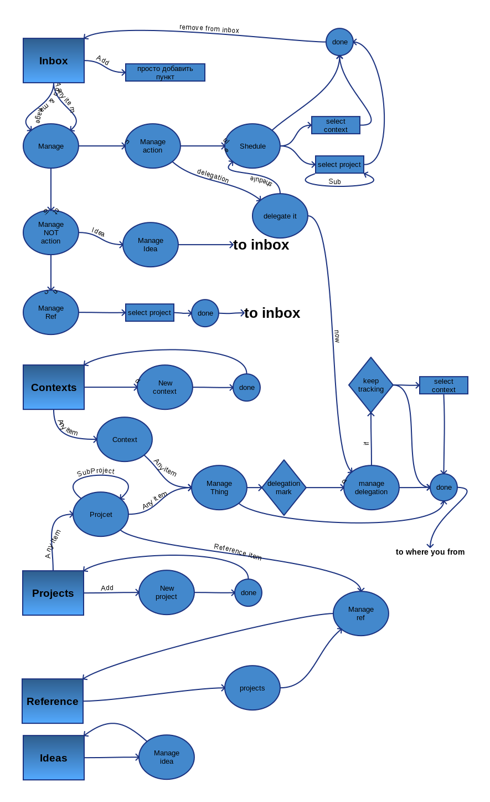

# Stuff Control - developer's documentation

## Local installation
1. git clone
2. npm i
3. bower install
4. gulp build (needs *sass* and *gulp cli* to be installed)
5. gulp watch - to watch changes in js and scss files
6. npm test - to run *karma* tests (with it's own watcher)

## Userfolow (old)

## [Blueprint pages (old)](oldBluePrint.md)
